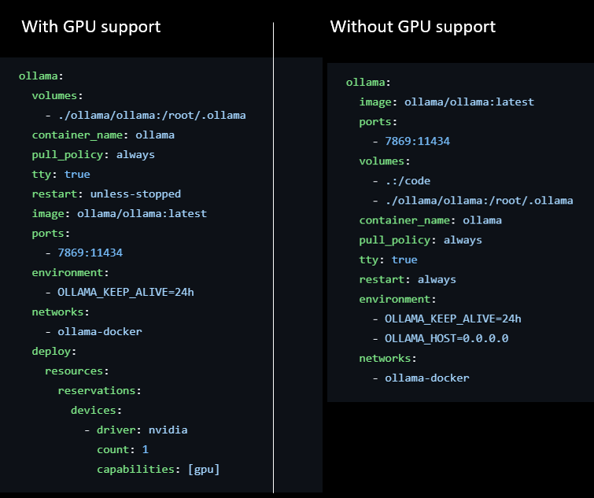
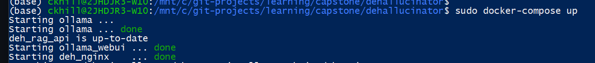
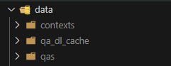

# DeHallucinator

As part of Harvard DCE Data Science Capstone (CSCI E-599a) this provides implementation of techniques to limit hallucination exposure to end-users as part of a RAG/LLM system.  Project includes development of 3 core modules:

* Measurement - provides a consistent approach to measuring RAG outcome (i.e. "answer") performance leveraging curated QA datasets.
* User Interface - provides capabilities to interact and refine with RAG chain processing to reduce hallucinated outputs.
* RAG API - provides implementation of advanced RAG approachs to provide guard-rails and mitigations to hallucinated outputs.

[](https://python.org/)

## Developer Setup

Project components are deployed via Docker containers with Docker-Compose orchestration.  High-level development architecture can be viewed [here](docs/docker_architecture.pptx) and additional details on specific Dockerized modules can be viewed [here](docs/docker_containers.md).  Module specific local development instructions can be found in READMEs within sub-project folders (e.g. [measurement](./measurement/), [rag_api](./rag_api/), and [ui](./ui/) respectively).

### IDE (Optional - VS Code)

It is recommended to use [VSCode](https://code.visualstudio.com/) as development IDE.  Specific Extensions/Configurations that are recommended include:

* Black Formatter (from Microsoft) - for automatic code formatting to PEP specifications
* Thunderbird Client - for REST API interactions
* JSON (from ZainChen) - for JSON file formatting
* Jupyter (from Microsoft) - for Jupyter Notebook support
* WSL (from Microsoft) - if using Windows WSL development environment
* Docker (from Microsoft) - for Docker file and resource management
* markdownlint - for Markdown (MD) file linting
* GitHub Pull Requests - integrates PR review feedback

### Windows Users (Recommended - WSL)

For Windows-based developers it is recommended that you [install WSL](https://learn.microsoft.com/en-us/windows/wsl/install) to provide a Linux-based (Ubuntu) tool chain environment.  It is possible to do project development directly in Windows environment given the use of Docker, but may pose some dependency conflict challenges.  Additionally majority of configuration examples will be provided assuming a Linux-based CLI.

### AWS Instances

For convenience [Terraform modules](./terraform/) are also provided to create AWS EC2 instances where local GPU-based development capabilites are not available.

### Docker installation

Depending on specific operating system installation of Docker may require different steps.  Developer may choose to install [Docker Engine (Docker CE)](https://docs.docker.com/engine/install/) w/ CLI support or full [Docker Desktop](https://docs.docker.com/desktop/).  Docker Desktop may be easier for developers less experienced with Docker to install and manage.

Once Docker is installed you should see Docker icon in taskbar (if using Desktop) or be able to successfully run commands like:

```bash
> sudo docker ps
```

As well as run test containers:

```bash
> sudo docker run hello-world
```

#### Enabling NVIDIA GPU Support for Docker

Given the use of LLMs via Ollama it is preferred to enable GPU support within your Docker containers.  Installation and configuration for GPU support via the NVIDIA container toolkit can be found [here](https://docs.nvidia.com/datacenter/cloud-native/container-toolkit/latest/install-guide.html).

If developer is unable to enable GPU support, Ollama docker-compose configuration can be adjusted to provide CPU-supported execution - though performance would be likley reduced.  An example of CPU configuration can be found [here](https://github.com/valiantlynx/ollama-docker/blob/main/docker-compose.yml) which basically entails removing the *deploy* section of the ollama service definition.  Comparison shown below:



#### Docker-Compose Plugin

If you have installed Docker Desktop or docker-ce then Docker Compose should already be included in installation.  You can confirm via:

```bash
> sudo docker-compose version
```

**Note:** Alternatively `docker compose` if you have installed via docker-compose-plugin as illustrated below.

If not available you may want to re-run [latest version installation](https://docs.docker.com/engine/install/ubuntu/#install-using-the-repository) via:

```bash
>  sudo apt-get install docker-ce docker-ce-cli containerd.io docker-buildx-plugin docker-compose-plugin
```

#### BuildX Plugin

The [BuildX plugin](https://github.com/docker/buildx) brings additional Build functionality to the `docker build` command and is required for project Docker builds.  Plugin can be installed via below if not already installed:

```bash
>  sudo apt-get install docker-buildx-plugin
```

## DEH Environment Launch via Docker Compose

The DEH environment can be launched via Docker Compose via the following:

```bash
./dehallucinator> docker-compose -f docker-compose-gpu.yml build
./dehallucinator> docker-compose -f docker-compose-gpu.yml up
```

**Note:** Command run from root directory of the code-base - e.g. the 'dehallucinator' directory that contains the docker-compose.yml file
**Note:** Cntrl+C can be used to shutdown all running containers in attached mode.  Alternatively `docker-compose down` can be executed.

Upon successful execution of docker-compose command you should see status of component launches and output of container logs:



### Useful Commands

Connect to a specific Docker container:

```bash
> sudo docker exec -it [container_name] bash
```

View current containers:

```bash
> sudo docker ps -a
```

Stop and start a specific service:

```bash
> sudo docker-compose stop [service name]
> sudo docker-compose start [service name]
```

Launch containers "detached" so that they run in background:

```bash
> sudo docker-compose up -d
```

Stream specific docker container logs:

```bash
> sudo docker logs --follow [container name]
```

View docker container resource utilization:

```bash
> sudo docker stats
```

## Download QA Data Corpus

The `data` folder is used to store specific document corpus files and is a local folder that is mounted to the `rag-api` docker container.  You can place whatever files you want in this container for RAG context processing (the folder is processed at the startup of the `rag-api` service).

For RAG execution only a Corpus is required.  For RAG performance measurement both a Corpus and a set of Question/Answer pairs is required.  Specifics on performance measurement and associated requirements can be found [here](https://docs.ragas.io/en/stable/concepts/metrics/index.html).

### Downloading the SQuADv2.0 QA Document Corpus

The following steps will enable the developer to download the [SQuADv2.0](https://rajpurkar.github.io/SQuAD-explorer/) data-set in a standard format.  SQuADAv2.0 provides both a corpus and paired Question-Answers that can be used for RAG performance measurement.  It will be the default measurement approach for RAG model assessment.

#### via Docker Container

A Docker container has been provided for convenience to enable SQuAD data download.  It can be executed via the following steps.

Build `deh_measurement` image from Dockerfile:

```bash
> docker build -t deh_measurement:latest ./measurement
```

For convenience this can be done via shell script as:

```bash
> ./measurement/utils/build_container.sh
```

**Note:** Command should be executed from project root directory (e.g. dehallucinator).  Image build is only required to do one-time.

Execute download utility:

```bash
> ./measurement/utils/download_squad_data.sh
```

**Note:** Command should be executed from project root directory (e.g. dehallucinator).

Result of utility should be creation of 3 folders in `data`:



* contexts - the document corpus of "raw information" that is used by the RAG chain.
* qa_dl_cache - a cache of the SQUAD QA dataset to prevent need to redownload in future processing.
* qas - a TSV file of questions and correct "ground truth" answer

The current SQUAD data-set includes over a thousand contexts and tens of thousands of question/answers so you may want to delete/limit for testing purposes.

#### In Local Development Environment

Alternatively you can execute Python utility within local development environment.

Change directory to measure folder:

```bash
> cd measurement
```

Create and activate a Python virtual environment:

```bash
> conda create -y --name=deh_measure_ python=3.10
> conda activate deh_measure
```

Install deh_measure packages:

```bash
> pip install -e .
```

Run SQUAD download utility (command line arguments can be included if desired but default to project compatible values):

```bash
> python squad_da_dl.py
```

## Evaluating RAG Performance

It is recommended that evaluation is done via [experiment Notebooks](./measurement/notebooks/) an example can be found [here](./measurement/notebooks/https://teams.microsoft.com/l/team/19%3A47f54120aa544f969bcf0c06f3932e25%40thread.tacv2/conversations?groupId=008b28c9-f221-4238-9411-dafd98a51c40&tenantId=3596192b-fdf5-4e2c-a6fa-acb706c963d8).

Top of experiment Notebook often provides parameters that can be adjusted.  Noteably `num_samples` selects the number of Question-Answers to run experiment on and `experiment_folder` provides the folder for storing and loading experiment results.

```python
num_samples:int = 100
experiment_folder:str = "../../data/evaluation/hyde-prompt-experiment/"
```

An example of an implemented experiment can be seen below.  The `generate_experiment_dataset` function takes a QA dataset and iterates over it calling the provided `api_endpiont` to get a JSON response from one of our deployed [APIs](./rag_api/).  The JSON is then converted to a Pandas DataFrame via the `convert` function.

It is then highly recommended that experiments save experiment results (since may involve LLM responses that take a long time to generate).  This allows others to load results from experiment for downstream analysis without having to re-run full experiment.

```python
def convert(response) -> pd.DataFrame:
    """Converts retrieved JSON response to Pandas DataFrame."""
    return pd.json_normalize(
        data=response["response"], record_path="context", meta=["question", "execution_time"]
    )

def api_endpoint(**kwargs) -> str:
    """Calls the context_retrieval API endpoint with no additional parameters (so default behavior)."""
    query_params = "&".join([f"{key}={kwargs[key]}" for key in kwargs])
    return f"http://{settings.API_ANSWER_ENDPOINT}/context_retrieval?{query_params}"

# Execute experiment
exp_df = generate_experiment_dataset(qa_set, convert, api_endpoint)

# Store resulting pandas Dataframe from experiment for later use.
exp_df.to_pickle( f"{experiment_folder}/experiment_file_name.pkl" )
```

## QA DataSet

An evaluation file should have a CSV structure simliar to the below.

*QA elements:*

* question - the question being asked
* contexts - the array of retrieved contexts via the RAG pipeline
* answer - the LLM generated answer
* ground_truth - the human generated correct answer

*Evaluation metrics:*

* answer_similiarity - the cosine similarity of answer and ground truth embeddings

**TODO:** Add more information on output measures.

*RAG and Assessment Hyper-Parameter elements:*

* llm_model - LLM model used in RAG API response generation
* llm_prompt - LLM prompt used in RAG API response generation
* embedding_model - the embedding model used in Vector Store embedding creation
* docs_loaded - number of context docs loaded into Vector Store
* assessment_llm - LLM model used in assessment for LLM-as-judge measurement
* assessment_embedding - Embedding model used in assessment for embedding comparison

## Developer Best Practices

* Do not directly commit code changes to `main` branch.  Use branches for development and create a PR (Pull Request) for merging.
* Scope branches for a specific change.  A branch should be short-lived to accomplish a particular goal.  Long-lived branches are often hard to merge into main due to code-drift.
* Do not merge code to main that fails Code Quality checks or other CI/CD assessments.  Take the time to clean up code formatting, etc. to keep code-base manageable.
* Add comments, doc-strings and other explanations to help others understand and build off of your code contributions.

### Git Commands for Branching

Git functionality is available natively within VS Code (and other IDEs) so that branch creation, branch selection

A new branch can be created via:

```bash
> git branch [new_branch_name]
> git checkout [new_branch_name]
```

Branches can be pushed to origin (i.e. github) via:

```bash
> git push -u origin [branch_name]
```

After branch commits and PR merge to main:

```bash
> git checkout main
> git pull
```

Now you are ready to create a new branch and repeat!
